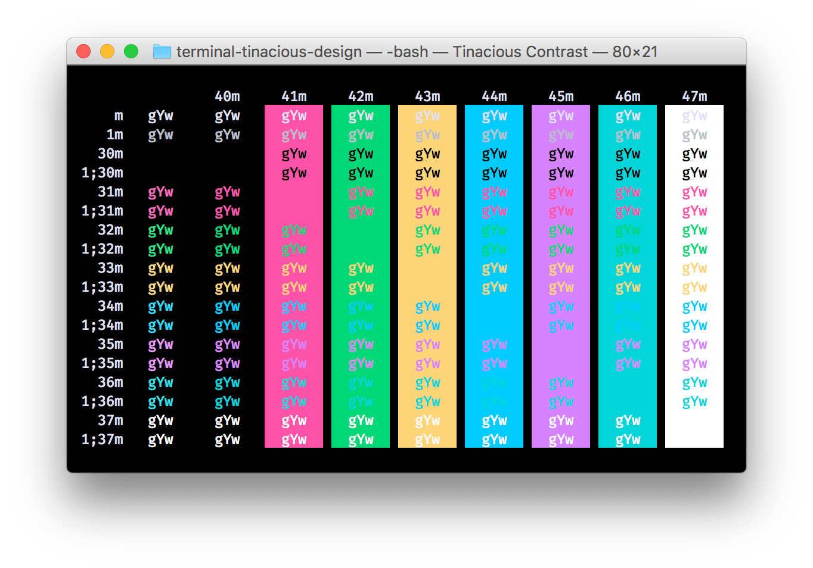

# Terminal Tinacious Design

Tinacious Design themes for macOS Terminal

---

Terminal themes based on [Tinacious Design Syntax](https://github.com/tinacious/vscode-tinacious-design-syntax). If applicable, attributions should be directed to the author and/or current maintainer of that codebase.

In addition, to the original colors, a higher contrast version is provided which minimally modifies some of the more muted colors.

## Tinacious Design theme

## Tinacious Contrast theme

